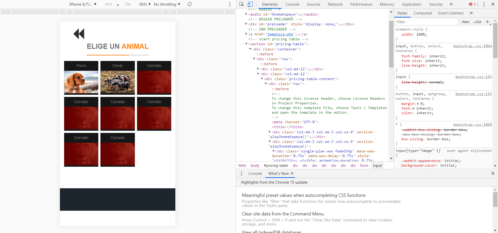

# Estrategia de interfaz humano computador en el desarrollo cognitivo de personas con trastornos del espectro autista

Trabajo de titulación presentado en conformidad a los requisitos para obtener el grado de Analista en Computación Científica.

# Análisis de Requerimientos

La realización de los requisitos se hizo junto al fonoaudiólogo Álvaro Rodríguez Leal y la especialista en TEA Loreto Henríquez Durán, con los que se hicieron diversas reuniones para generar una lluvia de ideas y posteriormente establecer los requisitos.

# Requerimientos funcionales

•	Registro de Temática (código, nombre, imagen).

•	Registro de Tema (código, nombre, imagen, temática).

•	Registro de Tipo Actividad (código, nombre, url página, url, imagen).

•	Registro de Actividad (código, nombre, tipo actividad).

•	Registro de Cuadro (código, actividad, imagen).

•	Registro de Imagen (código, url de la imagen, url del sonido asociado).

•	Registro de Tipo Usuario (código, nombre).

•	Registro de Usuario (id, contraseña, tipo usuario).

•	Registro de Historial (cuadro, actividad, usuario, fecha).

•	Generar Reporte de Historial.

•	Generar Reporte de interacciones a cuadros realizadas.

# Requerimientos no funcionales

•	Control de acceso a usuario.

•	El sistema tendrá una interfaz con un lenguaje adecuado y al nivel de atención del autista, además de mensajes claros, simples y precisos.

•	Disponibilidad 24/7.

•	El sistema presentará salidas con refuerzo positivo, es decir, con sonidos motivacionales cómo “vamos, tú puedes” o frases de este tipo.

# Requerimientos de implementación

•	El sistema debe ser web y adaptable tanto para celular, Tablet como computador (responsive).

# Diagrama de casos de uso

# Modelo de objetos del análisis

# Diagrama de estructura de datos (DED)

# Prints

# Ejemplo de Reporte #2

